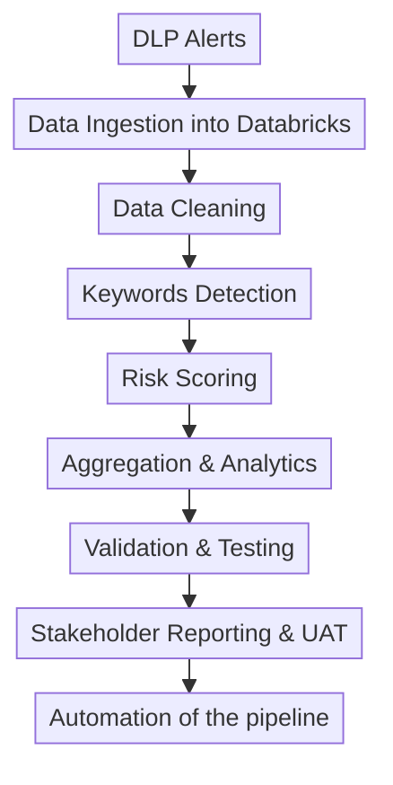
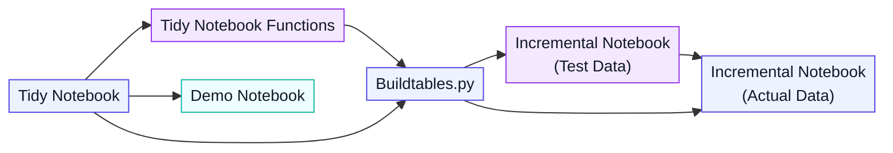

# Solution Framework

## Overall Workflow

The analytics pipeline can be summarized as:

This allows the DLP team to:

- Prioritize high-risk alerts
- Reduce manual review effort
- Monitor risk trends over time
- Improve scalability of investigations

In essence, the team is moving from a manual, reactive workflow toward a scalable and data-driven monitoring model.

---

## 1. Data Cleaning 

The first stage focused on preparing clean and reliable data.

???+ info "Tasks included:"

    - Removing duplicates
    - Filtering invalid records
    - Standardizing formats

This was important because inaccurate input data could significantly affect risk calculations and reporting outputs.

---

## 2. Keywords Detection 

The project focused heavily on refining detection logic for identifying potentially sensitive content.

???+ abstract "Detection logic details:"

    - Regex matching
    - Substring detection
    - Edge case validation
    - Case normalization

???+ danger "One major challenge was balancing:"

    - High sensitivity
    - Low false positives

Initially, simple keyword matching produced many irrelevant detections because certain terms appeared in unrelated contexts.

???+ success "To improve precision, the logic was refined using:"

    - Controlled substring matching
    - Additional filtering conditions
    - Better handling of mixed-case variations
    - Validation against edge cases

This reduced noisy detections while maintaining meaningful alert coverage.

---

## 3. Risk Scoring Framework

A rule-based scoring framework was developed to prioritize alerts based on risk severity.

???+ abstract "The framework:"

    - Assigned scores to alerts
    - Prioritized higher-risk policies
    - Handled overlapping detections
    - Aggregated scores at user level

???+ success "This enabled the DLP team to:"

    - Focus investigations on higher-risk users
    - Monitor risk trends over time
    - Build more structured investigation workflows

---

## 4. Aggregation & Analytics

<h3 style="color:#6d28d9;"> Table 1: aggregated rule hits and risk scores at the DLP alert level. </h3>

<table>
  <thead>
    <tr>
      <th style="background-color:#6d28d9;color:white;">Alert ID</th>
      <th style="background-color:#6d28d9;color:white;">User ID</th>
      <th style="background-color:#6d28d9;color:white;">Alert Date</th>
      <th style="background-color:#6d28d9;color:white;">Total Risk Score</th>
      <th style="background-color:#6d28d9;color:white;">R1 Risk Score</th>
      <th style="background-color:#6d28d9;color:white;">R2 Risk Score</th>
      <th style="background-color:#6d28d9;color:white;">...</th>
    </tr>
  </thead>
  <tbody>
    <tr style="background-color:#ede9fe;">
      <td>27</td>
      <td>A</td>
      <td>15 Nov</td>
      <td>1</td>
      <td>1</td>
      <td>0</td>
      <td></td>
    </tr>
    <tr style="background-color:#ddd6fe;">
      <td>119</td>
      <td>A</td>
      <td>9 Dec</td>
      <td>3</td>
      <td>0</td>
      <td>3</td>
      <td></td>
    </tr>
    <tr style="background-color:#ede9fe;">
      <td>84</td>
      <td>B</td>
      <td>3 Dec</td>
      <td>2</td>
      <td>0</td>
      <td>2</td>
      <td></td>
    </tr>
  </tbody>
</table>

---

<h3 style="color:#c026d3;"> Table 2: aggregated rule hits and risk scores at the staff level. </h3>

<table>
  <thead>
    <tr>
      <th style="background-color:#d946ef;color:white;">User ID</th>
      <th style="background-color:#d946ef;color:white;">Run Date</th>
      <th style="background-color:#d946ef;color:white;">Total Risk Score in Past Month</th>
      <th style="background-color:#d946ef;color:white;">R1 Risk Score in Past Month</th>
      <th style="background-color:#d946ef;color:white;">R2 Risk Score in Past Month</th>
      <th style="background-color:#d946ef;color:white;">...</th>
    </tr>
  </thead>
  <tbody>
    <tr style="background-color:#fae8ff;">
      <td>A</td>
      <td>10 Dec</td>
      <td>4</td>
      <td>1</td>
      <td>3</td>
      <td></td>
    </tr>
    <tr style="background-color:#f5d0fe;">
      <td>B</td>
      <td>10 Dec</td>
      <td>2</td>
      <td>0</td>
      <td>2</td>
      <td></td>
    </tr>
  </tbody>
</table>

---

<h3 style="color:#9333ea;">
Table 3: Table 1 and table 2 combined with aggregated rule hits and risk scores at the DLP alert level,
with longitudinal history of staff's past rule hits
</h3>

<table>
  <thead>
    <tr>
      <th style="background-color:#6d28d9;color:white;">Alert ID</th>
      <th style="background-color:#6d28d9;color:white;">User ID</th>
      <th style="background-color:#6d28d9;color:white;">Alert Date</th>
      <th style="background-color:#6d28d9;color:white;">Total Risk Score</th>
      <th style="background-color:#6d28d9;color:white;">R1 Risk Score</th>
      <th style="background-color:#6d28d9;color:white;">R2 Risk Score</th>

      <th style="background-color:#d946ef;color:white;">Run Date</th>
      <th style="background-color:#d946ef;color:white;">Total Risk Score in Past Month</th>
      <th style="background-color:#d946ef;color:white;">R1 Risk Score in Past Month</th>
      <th style="background-color:#d946ef;color:white;">R2 Risk Score in Past Month</th>
      <th style="background-color:#d946ef;color:white;">...</th>
    </tr>
  </thead>

  <tbody>
    <tr>
      <td style="background-color:#ede9fe;">27</td>
      <td style="background-color:#ede9fe;">A</td>
      <td style="background-color:#ede9fe;">15 Nov</td>
      <td style="background-color:#ede9fe;">1</td>
      <td style="background-color:#ede9fe;">1</td>
      <td style="background-color:#ede9fe;">0</td>

      <td style="background-color:#fae8ff;">10 Dec</td>
      <td style="background-color:#fae8ff;">4</td>
      <td style="background-color:#fae8ff;">1</td>
      <td style="background-color:#fae8ff;">3</td>
      <td style="background-color:#fae8ff;"></td>
    </tr>

    <tr>
      <td style="background-color:#ddd6fe;">119</td>
      <td style="background-color:#ddd6fe;">A</td>
      <td style="background-color:#ddd6fe;">9 Dec</td>
      <td style="background-color:#ddd6fe;">3</td>
      <td style="background-color:#ddd6fe;">0</td>
      <td style="background-color:#ddd6fe;">3</td>

      <td style="background-color:#f5d0fe;">10 Dec</td>
      <td style="background-color:#f5d0fe;">4</td>
      <td style="background-color:#f5d0fe;">1</td>
      <td style="background-color:#f5d0fe;">3</td>
      <td style="background-color:#f5d0fe;"></td>
    </tr>

    <tr>
      <td style="background-color:#ede9fe;">84</td>
      <td style="background-color:#ede9fe;">B</td>
      <td style="background-color:#ede9fe;">3 Dec</td>
      <td style="background-color:#ede9fe;">2</td>
      <td style="background-color:#ede9fe;">0</td>
      <td style="background-color:#ede9fe;">2</td>

      <td style="background-color:#fae8ff;">10 Dec</td>
      <td style="background-color:#fae8ff;">2</td>
      <td style="background-color:#fae8ff;">0</td>
      <td style="background-color:#fae8ff;">2</td>
      <td style="background-color:#fae8ff;"></td>
    </tr>
  </tbody>
</table>

The workflow evolved from static reporting into a more generalized analytics pipeline.

???+ "Tidy Notebook"
    Step by step from dataframe to Tables 1, 2, and 3, with output displayed after each step.

    Contains the documentation of all the code to get tables 1,2 and 3.

??? example "Tidy Notebook Functions"
    Mainly 3 functions:

    - `build_table1(df)` takes the raw data as input and outputs Table 1
    - `build_table2(df)` takes the raw data as input and outputs Table 2
    - `build_table3(table1, table2)` takes Tables 1 and 2 as inputs and outputs Table 3

    Can display after each function to check.

??? info "Demo Notebook" 
    Used for DLP team sharing. Displays Tables 1, 2, and 3, two risk-score scenarios, and ten selected staff examples.

???+ "Buildtables.py"
    Contains 3 functions:

    - `build_table1(df)` takes the raw data as input and outputs Table 1
    - `build_table2(df)` takes the raw data as input and outputs Table 2
    - `build_table3(table1, table2)` takes Tables 1 and 2 as inputs and outputs Table 3

    Required for the Incremental Notebook to run.

??? example "Incremental Notebook (Test Data)"
    Used to test the incremental logic and display outputs to check.

???+ "Incremental Notebook (Actual Data)"
    Incremental logic with actual data.

    Requires the three functions in `buildtables.py` to build and automate the three tables.

The pipeline supported:

- Multi-month analysis
- Dynamic aggregation windows
- User-level trend analysis

This improved flexibility and allowed the workflow to support broader stakeholder requirements.

---
## 5. Validation & Testing

Extensive testing and validation were performed throughout development.

???+ example "This included:"

    - Edge case testing
    - Manual verification
    - Scenario-based testing
    - Output comparison checks

???+ success "Validation was critical to ensure:"

    - No duplicate generation
    - Correct logic paths
    - Accurate aggregations
    - Reliable scoring outputs

---

## 6. Stakeholder Reporting & UAT 

???+ success "To improve usability for business users, outputs were designed to be:"

    - Easier to interpret
    - Clearly documented
    - Suitable for presentation and review

???+ success "Several improvements were introduced:"

    - Standardized naming conventions
    - Structured summary tables
    - Clearer reporting outputs
    - Supporting documentation and explanations
        
    Presentation materials and UAT guidance were also prepared to help stakeholders better understand how the pipeline works and how outputs should be interpreted.

## Business Impact

The new analytics pipeline significantly improves the scalability and efficiency of the DLP investigation workflow.

Previously, only 1–5% of alerts could realistically be reviewed manually due to resource constraints. With automated risk scoring and prioritisation, investigators can now focus on higher-risk alerts first, reducing investigation overhead and improving response efficiency.

The workflow also provides more structured and interpretable analytics outputs, allowing stakeholders to better monitor user-level risk trends and support more informed decision-making.