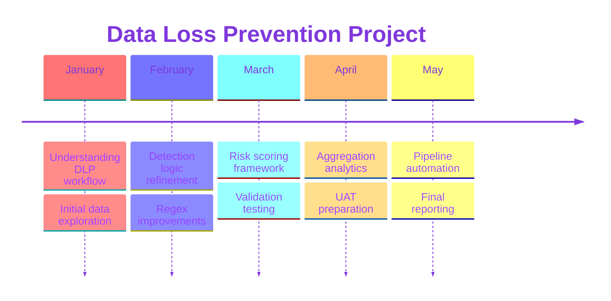

# Reflection & Conclusion

Throughout the internship, I gained valuable technical exposure to real-world data engineering and analytics workflows within a Data Loss Prevention (DLP) environment. I improved my understanding of data engineering processes, detection logic design, regex and substring matching techniques, as well as validation and testing strategies used to ensure output reliability. In addition, I gained hands-on experience in developing risk scoring systems and building scalable analytics pipelines to support automated monitoring and investigation workflows.

???+ abstract "One major takeaway from this project was that building effective solutions is not only about making code work, but ensuring that the outputs are:"

    - Scalable
    - Maintainable
    - Interpretable
    - Reliable for business use

???+ tip "The project also strengthened my understanding of the tradeoffs involved in real-world systems, particularly:"
    ??? tip "Sensitivity vs precision" 
        - A highly sensitive approach increased false positives and investigation workload, while overly strict filtering risked missing genuine incidents. 
        - Continuous refinement and validation were therefore necessary to balance alert coverage with output reliability.

    - Flexibility vs maintainability 
    - Technical complexity vs business usability

Beyond technical skills, the internship also improved my communication and collaboration abilities. Through stakeholder discussions, UAT preparation, presentation sharing, and iterative feedback sessions, I learned how to communicate technical concepts more effectively and align technical implementation with business requirements. This experience helped me better appreciate the importance of collaboration and continuous refinement when developing scalable analytics solutions.

Overall, the project successfully transformed a manual and reactive workflow into a more scalable, automated, and data-driven monitoring process. This internship strengthened my understanding of real-world data engineering and analytics workflows while improving my ability to design reliable and scalable solutions.