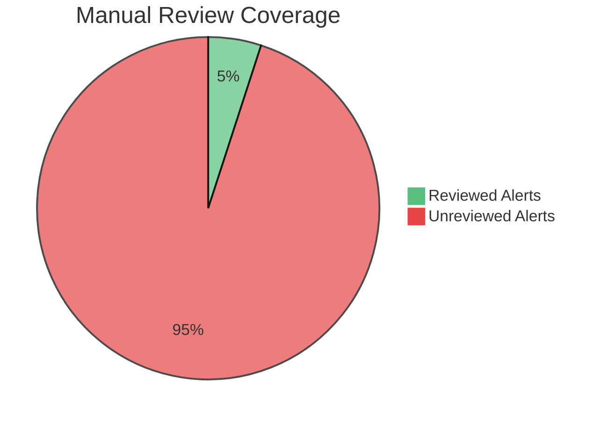

# Project Context

The DLP team manually reviews email alerts to identify high-risk cases. With about 8000 alerts per month, only 1-5% of alerts per rule can be reviewed due to resource constraint.  

This process is highly time-consuming, labour-intensive, and dependent on human judgment. As alert volumes increase, the manual approach introduces a significant risk of oversight, where true positive incidents may be missed or not flagged up promptly.

=== "Before"

!!! danger "Current Workflow Limitation"

    Approximately **8000 alerts/month** are generated, but only **1–5%** can realistically be reviewed manually.

    - Manual sampling of alerts 
    - Only 1–5% reviewed
    - Time-consuming investigation
    - High risk of oversight

The current workflow lacks automation, prioritisation, and intelligent filtering, resulting in inefficient resource use and potential delays in responding to genuine data-loss incidents.

=== "After"

!!! success "Key Improvement"

    The analytics pipeline automates alert prioritisation and enables scalable risk monitoring.

    - Automated scoring
    - Risk-based scoring
    - User-level analytics
    - Scalable monitoring workflow

With the new data analytics pipeline, we can automate this process. Alerts are ingested into Databricks, where rule-based analytics assign risk scores to each alert. This allows the DLP team to prioritise high-risk cases and build user-level risk profiles over time.

